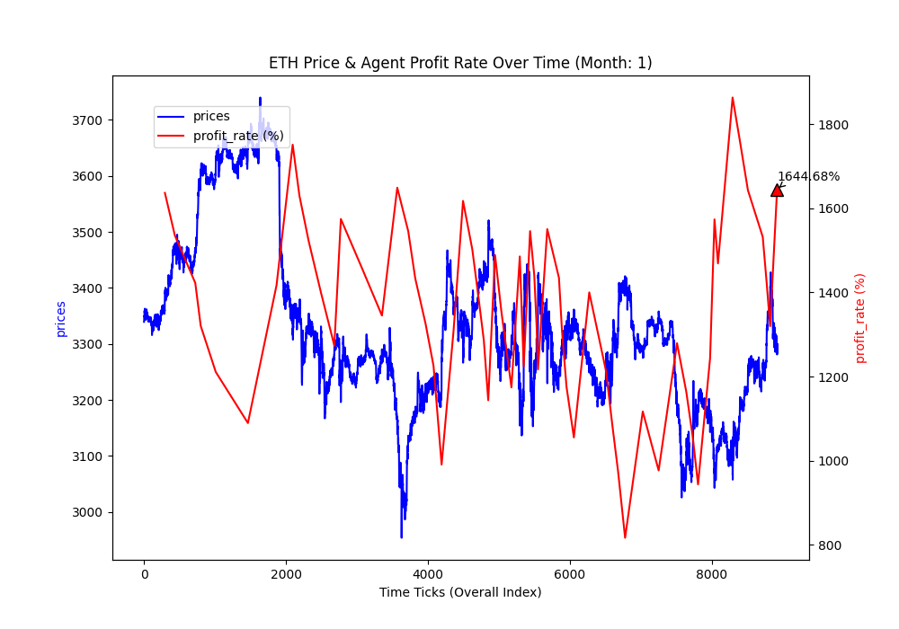
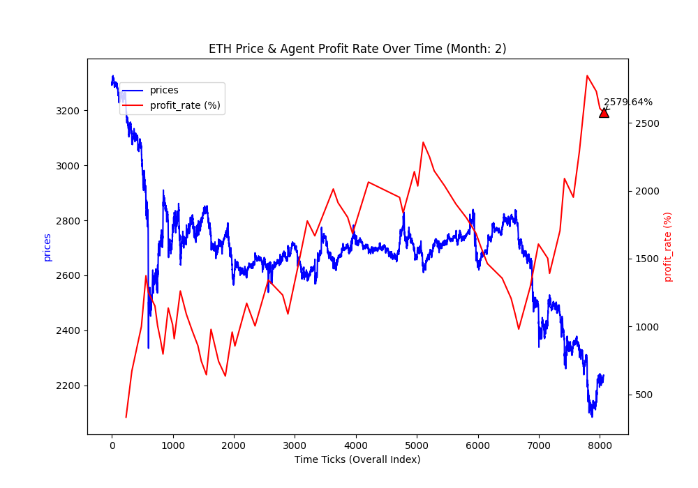
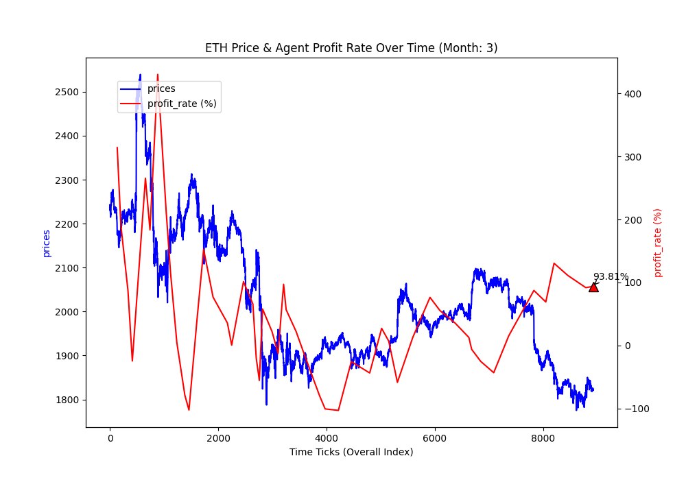
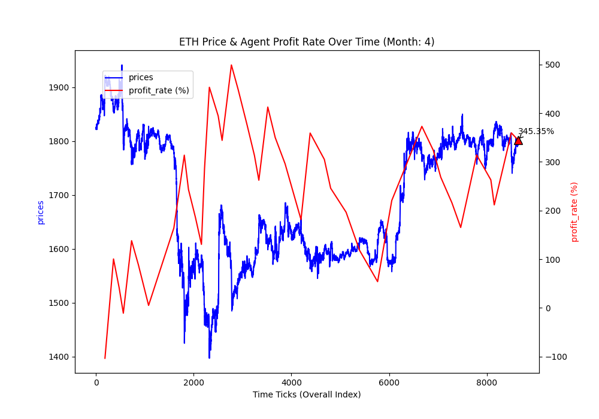

# Cryptocurrency Price Forecasting using Reinforcement Learning

This project applies reinforcement learning — specifically **Advantage Actor-Critic (A2C)** — to forecast cryptocurrency price trends and simulate trading strategies. The environment is custom-built based on historical **ETHUSDT** futures market data from Binance.

## Branch: `Model-A2C`
This branch implements the A2C algorithm for training an agent to learn profitable trading behaviors in a simulated crypto market.

## Trading Profit Rate (ETHUSDT, Jan–Apr 2025)

<table>
  <tr>
    <td align="center"><br>January</td>
    <td align="center"><br>February</td>
  </tr>
  <tr>
    <td align="center"><br>March</td>
    <td align="center"><br>April</td>
  </tr>
</table>

---

## Features

- Custom `gym`-based trading environment (`trading_env.py`)
- Advantage Actor-Critic (A2C) training architecture (`A2C.py`)
- Dynamic position sizing (long/short/hold) with 19 discrete actions
- Evaluation with test-time profit plotting
- Binance Futures (ETHUSDT, hourly kline data, Jan–Apr 2025)

---

## Model Description

### Agent
- **Actor Network** outputs a probability distribution over 19 discrete actions.
- **Critic Network** estimates state-value function \( V(s) \) to guide policy gradients.
- Trained using A2C with entropy regularization for exploration.

### Environment (`TradingEnv`)
- Observation:  
  Shape: `(48×4 + 4 + 48,) = 292`  
  Includes price-based features, unrealized profit, current asset, cash, position, and volume.

- Action Space:  
  19 discrete values ranging from -5 to +5 (position scaling).

- Reward:  
  Proportional to future price gain over a 3-tick latency period.

---

## Quick Start

### 1. Clone Repository

```bash
git clone --branch Model-A2C https://github.com/hcchung1/Cryptocurrency_Price_Forecasting.git
cd Cryptocurrency_Price_Forecasting
````

### 2. Install Requirements

```bash
pip install -r requirements.txt
```

or manually:

```bash
pip install torch gym pandas matplotlib tensorboard
```

### 3. Setup `gym-futures-trading` environment

```bash
git clone https://github.com/leafoliage/gym-futures-trading.git
cd gym-futures-trading
git checkout dev
pip install -e .
```

### 4. Run Training (Optional)

```bash
python A2C.py
```

This will train the A2C agent on the `futures1-v0` environment (Jan 2025 ETHUSDT).

### 5. Run Evaluation Only

```bash
python A2C.py  # evaluation is embedded after training
```

Outputs test results and saves plots to `/plot/`.

---

## Output

After training and evaluation:

* `./Tables/` will contain saved model weights (`A2C_actor_best.pt`, `A2C_critic_best.pt`)
* `./plot/` will contain profit-rate-over-time visualizations across 4 months

---

## Maintainer

This project was implemented by [@hcchung1](https://github.com/hcchung1) for the 2025 Artificial Intelligence Final Project. 

Also welcome to take a look of [my personal website](https://hcchung1.github.io).
