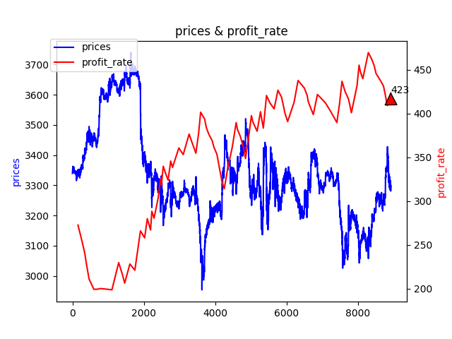
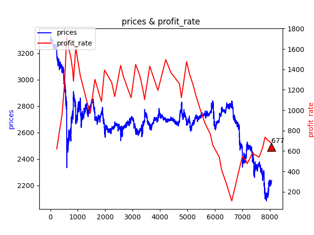
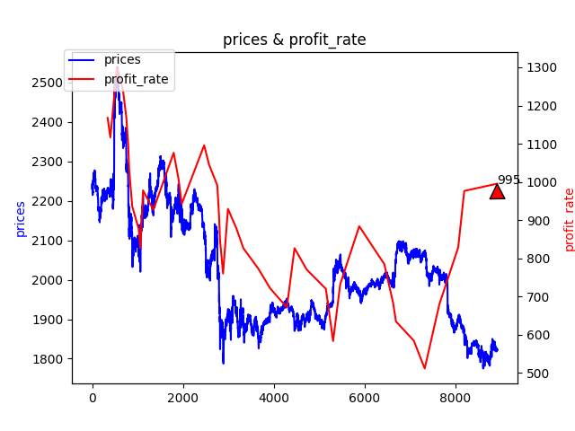
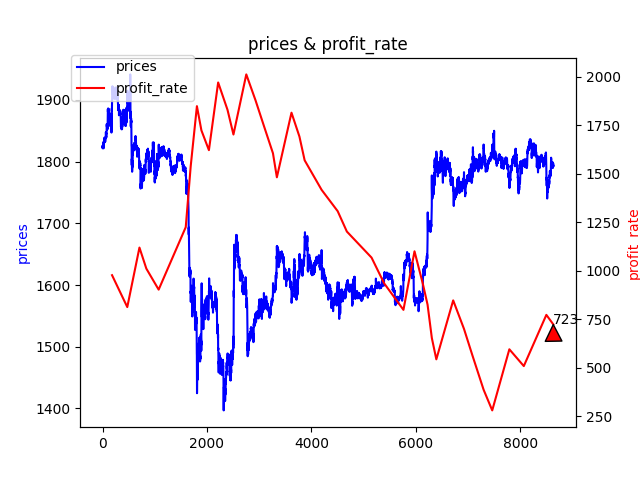

# Cryptocurrency Price Forecasting
## 2025 人工智慧概論期末專題  Introduction to A.I. Final Project
### Arthur: Henry Chung(鍾承翰), Eric Chen(陳景寬), 范伯綱, Patrick Wu


### Requirements: Pytorch
### Environments: Python 3.10
---

Data Source: [Binance API](https://github.com/binance/binance-public-data)

---

## Algorithm Overview

This repository implements and compares two popular reinforcement learning algorithms:

### 🧠 Deep Q-Network (DQN)

DQN is a **value-based** reinforcement learning method that approximates the optimal action-value function using a deep neural network. It selects actions using an ε-greedy policy and updates Q-values based on the Bellman equation. This implementation uses enhancements such as:

- Experience Replay
- Target Network with Soft Updates
- Huber Loss for stable training
- ε decay scheduling
- Double DQN (optional)

DQN is well-suited for discrete action spaces, making it ideal for our 19-action cryptocurrency trading setup.

### 🎯 Advantage Actor-Critic (A2C)

A2C is a **policy-based** method that uses two neural networks:
- **Actor**: proposes actions
- **Critic**: evaluates how good the action is (value estimation)

A2C is better at handling continuous action spaces and naturally models stochastic policies. It optimizes the policy directly using advantage estimates and is generally more stable in highly dynamic environments.

📂 You can find our A2C implementation in the [`Model-A2C` branch](https://github.com/hcchung1/Cryptocurrency_Price_Forecasting/tree/Model-A2C).

---

In this project, we primarily focus on DQN for its simplicity and compatibility with discrete action sets. However, users are encouraged to explore the A2C branch for comparison or further experimentation.

---

## Trading Profit Rate (ETHUSDT, Jan – Apr 2025)

|  |  |
| -------------------------- | --------------------------- |
| **January** | **February** |

|    |     |
| -------------------------- | --------------------------- |
| **March**   | **April**    |

---

## Features

- Custom `` trading environment (`trading_env.py`)
- **Deep Q-Network** training script (`DQN.py`)
- Replay buffer with prioritized sampling and soft-update target network
- 19 discrete trading actions (scalable long/short & hold)
- Evaluation mode with test-time profit plots
- Compatible with hourly ETHUSDT Binance Futures klines (Jan–Apr 2025)

---
## Quick Start

### 1  Clone the Repository

```bash
git clone --branch Model-DQN https://github.com/hcchung1/Cryptocurrency_Price_Forecasting.git
cd Cryptocurrency_Price_Forecasting
```

### 2  Install Requirements

```bash
pip install -r requirements.txt
```

### 3  Install gym-futures-trading

```bash
git clone https://github.com/ericchen1121/gym-futures-trading.git
cd gym-futures-trading
git checkout dev
pip install -e .
cd ..
```

### 4  Run Training/Testing

```bash
python DQN.py
```
You can change the model and env in __main__.


Related Projects: 
- [AI-2024-Final-Project](https://github.com/Otmeal/AI-2024-final-project)
- [gym Future Trading Environment](https://github.com/leafoliage/gym-futures-trading/tree/dev)
